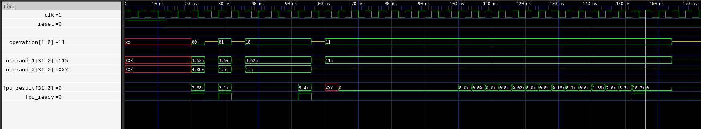

Computer Organization - Spring 2024
==============================================================
## Iran Univeristy of Science and Technology
## Final project

- Name: Mahdi Ghofran
- Team Members: -
- Student ID: 99412384
- Date:7/2/2024

____________________________________________________________________________________________

____________________________________________________________________________________________

____________________________________________________________________________________________

## Report

1. Introduction
The goal of this project is to study the multi-cycle implementation of a RISC-V processor and add a fixed-point arithmetic unit. This processor will execute a simple RISC-V assembly code to calculate the distance of lines connecting different points on a map using the LUMOS RISC-V processor core. LUMOS stands for Light Utilization with Multicycle Operational Stages. The multi-cycle implementation allows for more complex instructions and better utilization of processor resources. This processor supports a subset of the 32-bit base integer ISA of RISC-V, making it suitable for light applications.

2. LUMOS RISC-V Core
The LUMOS RISC-V core is designed with a multi-cycle implementation, where each instruction is broken down into a series of steps corresponding to various functional units. Each step takes one clock cycle to complete. This approach allows different functional units to be reused across multiple clock cycles, reducing the required hardware.

The processor design is partitioned into data path and control path designs:

Data Path Design: Focuses on the ALU, registers, and memory access.
Control Path Design: Focuses on state machines to decode instructions and generate control signals.
Instruction Execution Flow
Instruction Fetch: The program counter (PC) register contains the address of the instruction to be fetched. The instruction is read from memory and stored in the instruction register (IR).
Instruction Decode: The opcode, funct3, funct7, and other fields are decoded according to the RISC-V ISA.
Operand Fetch: Values are read from the register file and assigned to registers RS1 and RS2.
Execution: The ALU performs operations using operands from RS1, RS2, and immediate values.
Write-Back: Results are written back to the register file.
3. Fixed-Point Unit
In addition to the base integer ISA (RV32I), a fixed-point arithmetic unit is added to support approximate fixed-point calculations for instructions like FADD, FSUB, FMUL, and FSQRT. This unit utilizes a Q22.10 fixed-point format with 32-bit registers.

Fixed-Point Arithmetic
Q Notation: Used to express the number of integer and fractional bits (e.g., Q4.4).
Range and Precision: Determines the representable range and precision based on the number of bits.
Conversion: Between fixed-point and integer values using bit shifts.
4. Fixed-Point Multiplication
Algorithm
Fixed-point multiplication involves:

Multiplying two fixed-point numbers, resulting in a product with twice as many fractional bits.
Shifting the product right by the number of fractional bits to restore the fixed-point format.
Verilog Implementation
_________________________________________________________________________________________________________

``
module FixedPointMul (
    input [31:0] a,  // Q22.10 format
    input [31:0] b,  // Q22.10 format
    output [31:0] prod  // Q22.10 format
);
    // Perform multiplication and then shift right by 10 bits
    assign prod = (a * b) >> 10;
endmodule
``
_________________________________________________________________________________________________________

5. Fixed-Point Square Root Calculation
Algorithm
The square root calculation uses a digit-by-digit approach:

Initialize the result to 0.
Iterate through pairs of digits from the most significant to the least significant.
For each iteration:
Bring down the next pair of digits.
Append a digit to the result and attempt subtraction.
If the result is non-negative, retain the digit; otherwise, discard it.
This approach is extended to fixed-point numbers by accounting for fractional bits.
_________________________________________________________________________________________________________
Verilog Implementation
``
module FixedPointSqrt #(
    parameter WIDTH = 32,
    parameter FBITS = 10
)(
    input clock,
    input reset,
    input start,
    input [WIDTH-1:0] radicand,
    output reg [WIDTH-1:0] result,
    output reg done
);

    localparam ITERATIONS = (WIDTH + FBITS) / 2;
    
    reg [WIDTH*2-1:0] radicand_shifted;
    reg [WIDTH-1:0] partial_result;
    reg [WIDTH*2-1:0] subtraction_result;
    reg [5:0] iteration;

    always @(posedge clock or posedge reset) begin
        if (reset) begin
            result <= 0;
            partial_result <= 0;
            radicand_shifted <= 0;
            subtraction_result <= 0;
            iteration <= 0;
            done <= 0;
        end else if (start) begin
            result <= 0;
            partial_result <= 0;
            radicand_shifted <= {radicand, {(WIDTH){1'b0}}};
            subtraction_result <= 0;
            iteration <= 0;
            done <= 0;
        end else if (iteration < ITERATIONS) begin
            // Bring down the next pair of digits
            radicand_shifted <= radicand_shifted << 2;
            partial_result <= (partial_result << 1) | 1;
            subtraction_result <= (subtraction_result << 2) | (radicand_shifted[WIDTH*2-1:WIDTH*2-2]);
            if (subtraction_result >= partial_result) begin
                subtraction_result <= subtraction_result - partial_result;
                result <= (result << 1) | 1;
            end else begin
                partial_result <= partial_result - 1;  // discard the subtraction
                result <= result << 1;
            end
            iteration <= iteration + 1;
        end else begin
            done <= 1;
        end
    end
endmodule
``
_________________________________________________________________________________________________________

6. Integration into the LUMOS RISC-V Core
Here's how the fixed-point units are integrated into the LUMOS RISC-V core:

_________________________________________________________________________________________________________
``
module LUMOS (
    input clock,
    input reset,
    // other necessary inputs and outputs
);

    // Register and wire declarations
    reg [31:0] PC, ir, aluResult, memoryDataRegister;
    wire [31:0] instruction, aluOut, regData1, regData2, immediate;
    reg instructionOrData, memoryReady, irWrite, aluSrc1, aluSrc2;
    wire [31:0] fpRegData1, fpRegData2, fpResult;
    reg fpWe;
    wire sqrtDone;
    // Add other necessary registers and wires

    // FSM States
    typedef enum logic [2:0] {
        FETCH,
        DECODE,
        EXECUTE,
        MEMORY,
        WRITEBACK
    } state_t;
    state_t currentState, nextState;

    // Instantiate the fixed-point register file
    FixedPointRegisterFile fpRegFile (
        .clock(clock),
        .reset(reset),
        .we(fpWe),
        .rs1(ir[19:15]),
        .rs2(ir[24:20]),
        .rd(ir[11:7]),
        .wd(fpResult),
        .rd1(fpRegData1),
        .rd2(fpRegData2)
    );

    // Instantiate the fixed-point multiplier
    FixedPointMul fpMul (
        .a(fpRegData1),
        .b(fpRegData2),
        .prod(fpResult)
    );

    // Instantiate the fixed-point square root calculator
    FixedPointSqrt #(
        .WIDTH(32),
        .FBITS(10)
    ) fpSqrt (
        .clock(clock),
        .reset(reset),
        .start(startSqrt),
        .radicand(fpRegData1),
        .result(fpResult),
        .done(sqrtDone)
    );

    // Instruction Fetch
    always @(posedge clock or posedge reset) begin
        if (reset) begin
            currentState <= FETCH;
            PC <= 0;
        end else begin
            currentState <= nextState;
            if (irWrite)
                ir <= instruction;
            // Add other state transitions and actions
        end
    end

    // FSM Next State Logic
    always @(*) begin
        case (currentState)
            FETCH: begin
                instructionOrData = 1; // Set to fetch instruction
                if (memoryReady) begin
                    irWrite = 1;
                    nextState = DECODE;
                end else begin
                    nextState = FETCH;
                end
            end
            DECODE: begin
                // Decode logic
                nextState = EXECUTE;
            end
            EXECUTE: begin
                // Execution logic
                nextState = MEMORY;
            end
            MEMORY: begin
                // Memory access logic
                nextState = WRITEBACK;
            end
            WRITEBACK: begin
                // Write-back logic
                nextState = FETCH;
            end
            default: nextState = FETCH;
        endcase
    end

    // ALU and other data path components
    // ...

endmodule
``
_________________________________________________________________________________________________________