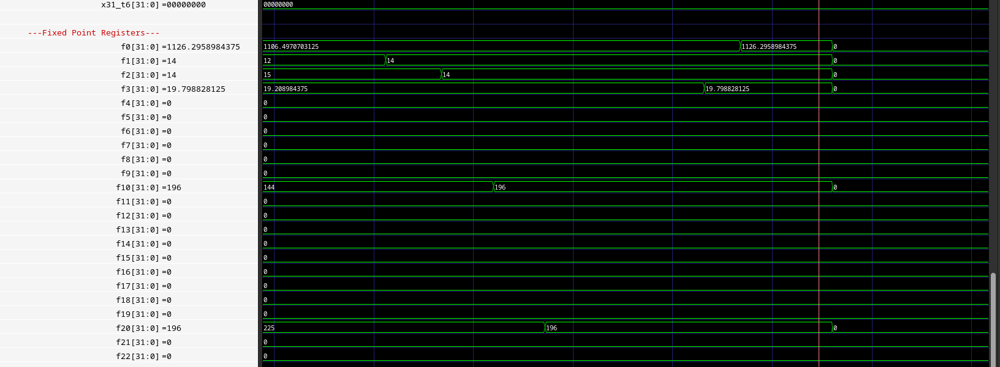

Computer Organization - Spring 2024
==============================================================
## Iran Univeristy of Science and Technology
## Final project

- Name: Mahdi Ghofran
- Team Members: -
- Student ID: 99412384
- Date:7/2/2024

## Results
____________________________________________________________________________________________


____________________________________________________________________________________________


____________________________________________________________________________________________

____________________________________________________________________________________________

## Report

1. Introduction

The goal of this project is to study the multi-cycle implementation of a RISC-V processor and add a fixed-point arithmetic unit. This processor will execute a simple RISC-V assembly code to calculate the distance of lines connecting different points on a map using the LUMOS RISC-V processor core. LUMOS stands for Light Utilization with Multicycle Operational Stages. The multi-cycle implementation allows for more complex instructions and better utilization of processor resources. This processor supports a subset of the 32-bit base integer ISA of RISC-V, making it suitable for light applications.

2. LUMOS RISC-V Core

The LUMOS RISC-V core is designed with a multi-cycle implementation, where each instruction is broken down into a series of steps corresponding to various functional units. Each step takes one clock cycle to complete. This approach allows different functional units to be reused across multiple clock cycles, reducing the required hardware.

The processor design is partitioned into data path and control path designs:

Data Path Design: Focuses on the ALU, registers, and memory access.
Control Path Design: Focuses on state machines to decode instructions and generate control signals.
Instruction Execution Flow
Instruction Fetch: The program counter (PC) register contains the address of the instruction to be fetched. The instruction is read from memory and stored in the instruction register (IR).
Instruction Decode: The opcode, funct3, funct7, and other fields are decoded according to the RISC-V ISA.
Operand Fetch: Values are read from the register file and assigned to registers RS1 and RS2.
Execution: The ALU performs operations using operands from RS1, RS2, and immediate values.
Write-Back: Results are written back to the register file.

3. Fixed-Point Unit

In addition to the base integer ISA (RV32I), a fixed-point arithmetic unit is added to support approximate fixed-point calculations for instructions like FADD, FSUB, FMUL, and FSQRT. This unit utilizes a Q22.10 fixed-point format with 32-bit registers.

Fixed-Point Arithmetic
Q Notation: Used to express the number of integer and fractional bits (e.g., Q4.4).
Range and Precision: Determines the representable range and precision based on the number of bits.
Conversion: Between fixed-point and integer values using bit shifts.

4. Fixed-Point Multiplication

Algorithm
Fixed-point multiplication involves:

Multiplying two fixed-point numbers, resulting in a product with twice as many fractional bits.
Shifting the product right by the number of fractional bits to restore the fixed-point format.

The provided Verilog file appears to define a Fixed-Point Unit (FPU) module. Here’s a summary of its content and functionality:

- Module Name: `Fixed_Point_Unit`

- Parameters: 

  - `WIDTH`: Data width, default is 32 bits.
  - `FBITS`: Fractional bits, default is 10 bits.

Inputs

- `clk`: Clock signal.
- `reset`: Reset signal.
- `operand_1`: First operand for operations (WIDTH bits).
- `operand_2`: Second operand for operations (WIDTH bits).
- `operation`: Operation selector (2 bits).

Outputs

- `result`: Result of the operation (WIDTH bits).
- `ready`: Ready signal to indicate the completion of the operation.

Internal Signals

- `root`:

 Register to store the result of the square root operation.

- `root_ready`:

 Signal to indicate the readiness of the square root operation result.

- `product`: 
Register to store the intermediate product of multiplication.

- `product_ready`: 

Signal to indicate the readiness of the product from the multiplication.

Functionality

1. Arithmetic Operations:

The `always @(*)` block contains a case statement that performs the operation based on the `operation` input:
Addition (`FPU_ADD`): `result <= operand_1 + operand_2;`
Subtraction (`FPU_SUB`): `result <= operand_1 - operand_2;`
Multiplication (`FPU_MUL`): `result <= product[WIDTH + FBITS - 1 : FBITS];`
Square Root (`FPU_SQRT`): `result <= root;`
Default case: `result <= 'bz;`
The `ready` signal is set to 1 for addition and subtraction, and is linked to specific ready signals for multiplication and square root operations.

2. Reset Handling:

The `always @(posedge reset)` block sets the `ready` signal to 0 on reset.

3. Multiplier Circuit :

The module defines a 64-bit product register to store multiplication results.
 It uses four 16-bit multipliers to break down the multiplication of 32-bit operands:
     `A1` and `A2` are lower and upper 16 bits of `operand_1`.
     `B1` and `B2` are lower and upper 16 bits of `operand_2`.
     The partial products `P1`, `P2`, `P3`, and `P4` are computed using these 16-bit segments.
     The partial products are summed to form the final product.

Multipliers

Multiplier Instances:

 The module uses four instances of another module named `Multiplier` to compute partial products:
    ```verilog
    Multiplier multiplier1 (.operand_1(A1), .operand_2(B1), .product(P1));
    Multiplier multiplier2 (.operand_1(A1), .operand_2(B2), .product(P2));
    Multiplier multiplier3 (.operand_1(A2), .operand_2(B1), .product(P3));
    Multiplier multiplier4 (.operand_1(A2), .operand_2(B2), .product(P4));
    ```

Missing Details

 The file references an included file `Defines.vh`, which likely contains macro definitions for the operations (e.g., `FPU_ADD`, `FPU_SUB`, etc.).
 The full implementation details of the square root circuit are not visible in the provided snippet.
 The `Multiplier` module is instantiated but its internal implementation is not provided in this file.

Summary

The `Fixed_Point_Unit` module is designed to perform fixed-point arithmetic operations, including addition, subtraction, multiplication, and square root. It uses parameterized bit-widths and relies on additional modules and macros to function correctly. The design separates arithmetic operations into combinational logic with readiness signaling and reset handling to ensure proper operation sequencing.